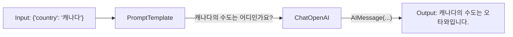

LLM(거대 언어 모델)을 활용한 애플리케이션 개발 시, 안정적이고 확장 가능한 구조를 만드는 것이 중요합니다. 이 글에서는 LangChain 사용 시 꼭 알아야 할 핵심 구성요소들을 단계별로 살펴봅니다.

## 1. 환경변수 로드: 안전한 API 키 관리

API 키 같은 민감한 정보를 코드에 직접 작성하는 것은 보안 위험이 큽니다. `python-dotenv`로 `.env` 파일을 사용해 안전하게 관리합니다.

```python
from dotenv import load_dotenv

load_dotenv()
```

- 프로젝트 루트에 `.env` 파일을 생성
- 내부에 `OPENAI_API_KEY="sk-..."` 형식으로 키 저장
- `.env` 파일은 반드시 `.gitignore`에 추가하여 Git에 업로드되지 않도록 관리
- `load_dotenv()`로 환경변수 로드

## 2. ChatOpenAI: LLM 모델과 상호작용하기

ChatOpenAI는 OpenAI의 채팅 모델을 쉽게 사용할 수 있도록 해줍니다.

| 주요 파라미터 | 설명 |
| ------------ | ---- |
| `temperature` | 창의성 조정 (0~2) |
| `max_tokens` | 최대 토큰 수 제한 |
| `model_name` | 사용할 모델 (`gpt-4o`, `gpt-4-turbo`, `gpt-3.5-turbo`) |

```python
from langchain_openai import ChatOpenAI

llm = ChatOpenAI(temperature=0, model_name="gpt-4o")
```

- `temperature`를 낮게 설정하면 더 일관성 있고 예측 가능한 답변을 얻을 수 있으며, 높게 설정하면 더 창의적인 답변을 얻을 수 있습니다.
- 비용 관리를 위해 `max_tokens`를 적절하게 설정하는 것이 중요합니다.

## 3. 프롬프트 템플릿(`PromptTemplate`) 활용

동적으로 프롬프트를 생성하여 재사용성을 높이는 방법입니다.

```python
from langchain_core.prompts import PromptTemplate

template = "{country}의 수도는 어디인가요?"
prompt_template = PromptTemplate.from_template(template)

final_prompt = prompt_template.format(country="대한민국")
print(final_prompt)  # 대한민국의 수도는 어디인가요?
```

- 다양한 입력값에 따라 프롬프트를 동적으로 생성할 수 있어, 여러 상황에서 효과적으로 활용 가능합니다.

## 4. LCEL 파이프라인 구축: 모든 구성 요소 연결

LCEL을 통해 프롬프트, LLM, 파서를 파이프라인 형태로 직관적이고 깔끔하게 연결합니다.



### 💻 전체 실행 코드

```python
from dotenv import load_dotenv
from langchain_teddynote import logging
from langchain_openai import ChatOpenAI
from langchain_core.prompts import PromptTemplate
from langchain_core.output_parsers import StrOutputParser
from langchain_teddynote.messages import stream_response

load_dotenv()
logging.langsmith("CH01-Basic")

llm = ChatOpenAI(model="gpt-4o", temperature=0)

template = "{country}의 수도는 어디인가요?"
prompt = PromptTemplate.from_template(template)

output_parser = StrOutputParser()

chain = prompt | llm | output_parser

stream_response(chain.stream({"country": "캐나다"}))
```

### 🖥️ 실행 결과

```
캐나다의 수도는 오타와입니다.
```

LCEL을 활용하면, 파이프라인 각 단계의 독립적인 구성요소를 쉽게 교체하거나 추가할 수 있어 유지보수와 확장성이 뛰어난 LLM 애플리케이션을 손쉽게 개발할 수 있습니다.

## 5. Chain 생성과 동작 방식

LangChain Expression Language(LCEL)는 Unix의 파이프 연산자(`|`)처럼 구성 요소를 연결합니다. 다음과 같은 간단한 코드로 프롬프트 → 모델 → 파서로 데이터를 흐르게 할 수 있습니다.

```python
chain = prompt | model | output_parser
```

- `|` 연산자는 앞의 구성 요소의 출력을 다음 구성 요소의 입력으로 넘깁니다.
- 각 컴포넌트는 독립적으로도 사용할 수 있으며, 파이프라인 방식으로 결합 시 훨씬 깔끔하게 동작 흐름을 구성할 수 있습니다.


### invoke() 메서드로 실행하기

LangChain에서는 체인을 실행할 때 `.invoke()` 메서드를 사용합니다. 입력은 Python 딕셔너리 형태로 전달합니다.

```python
from langchain_core.prompts import PromptTemplate
from langchain_openai import ChatOpenAI

prompt = PromptTemplate.from_template("{topic} 에 대해 쉽게 설명해주세요.")
model = ChatOpenAI(model="gpt-4.1-nano", temperature=0.1)

chain = prompt | model

input = {"topic": "인공지능 모델의 학습 원리"}
response = chain.invoke(input)
print(response)
```

### 🖥️ 실행 결과

```python
AIMessage(content="물론입니다! 인공지능 모델의 학습 원리를 쉽게 설명해 드릴게요.\n\n1. **데이터 수집**: 먼저, 인공지능이 배우기 위해 많은 예제(데이터)를 모아요. 예를 들어, 고양이 사진을 많이 보여주는 거죠.\n\n2. **모델 설계**: 그런 다음, 이 데이터를 이해하고 학습할 수 있는 '모델'이라는 수학적 구조를 만듭니다. 이 모델은 사람의 뇌와 비슷하게 정보를 처리하려고 해요.\n\n3. **학습 과정**:\n   - 모델은 처음에는 무작위로 예측하거나 판단을 해요.\n   - 그리고 실제 정답(예를 들어, 사진이 고양이인지 아닌지)을 알려줍니다.\n   - 모델은 자신의 예측이 틀렸다는 것을 알고, 틀린 정도(오차)를 계산해요.\n   - 이 오차를 줄이기 위해 모델의 내부 값(가중치)을 조금씩 조정합니다. 이 과정을 여러 번 반복하면서 점점 더 정확하게 예측하게 되는 거죠.\n\n4. **최적화**: 이 과정을 통해 모델은 오차를 최소화하는 방향으로 계속 조정돼요. 이렇게 해서 학습이 끝나면, 새로운 사진이 들어왔을 때도 고양이인지 아닌지 잘 맞출 수 있게 되는 겁니다.\n\n요약하자면, 인공지능은 많은 데이터를 보고, 틀린 점을 수정하면서 점점 더 똑똑해지는 과정이라고 할 수 있어요!")
```

이처럼 `invoke()`는 단순하고 명확하게 입력값을 전달하고, 전체 체인의 결과를 한 줄로 받아볼 수 있는 직관적인 실행 방식입니다.
